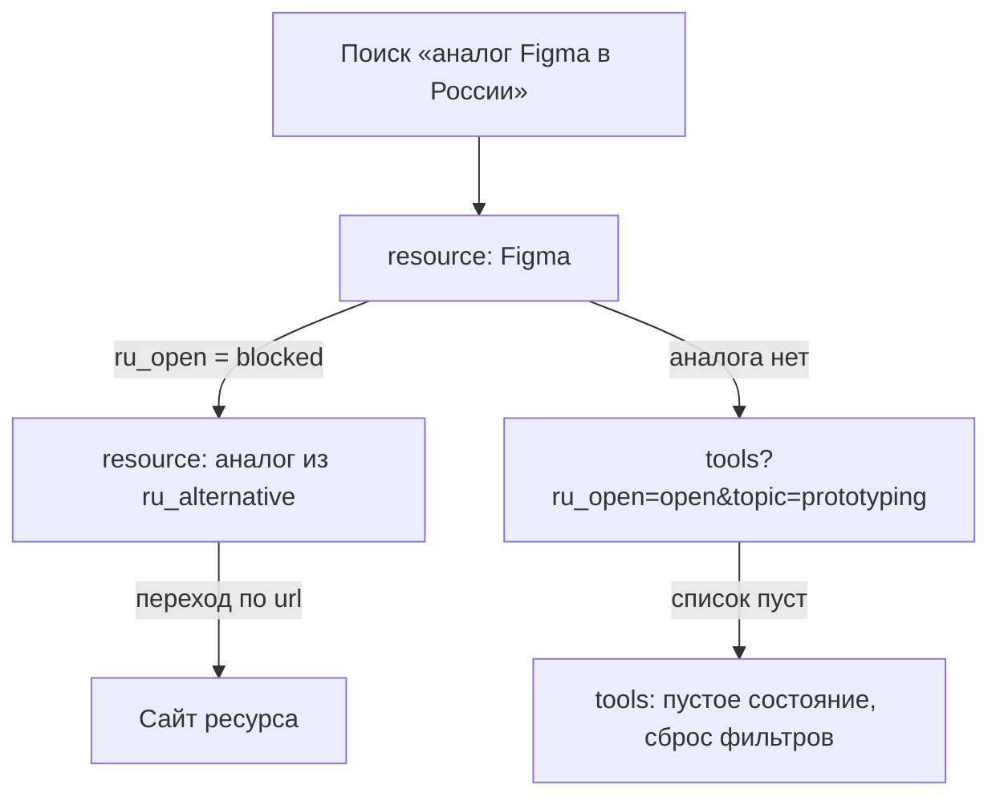

# Директива 07: Карта сайта и user flows

> Этап 07 конвейера (00_pipeline.md). Вход: `docs/spec.md`, `docs/brief.md` §4 (JTBD), §6 (IA), §7 (WordPress). Выход: `docs/ia/pages-inventory.md`, `docs/ia/sitemap.md`, `docs/ia/flows/<scenario>.mmd`, `docs/ia/open-questions.md`. Запуск: `/directive 07`

## Задача

Превратить ТЗ и черновую IA из брифа в утверждённую карту сайта: полный инвентарь страниц (включая служебные), дерево URL глубиной ≤3, приоритеты, user flows для шести MVP-сценариев, схема навигации и сверка с тем, как WordPress реально отдаст такие URL. Всё — в тексте, с апрувом после каждой фазы. Карта сайта из brief §6 уже есть; её нужно **детализировать и проверить**, а не придумать заново.

## Когда применять

После утверждения `docs/spec.md` (директива 06) и до первого wireframe (08). Повторно — когда в ТЗ добавились функции, страницы или изменились слаги: директива перечитывает существующие файлы в `docs/ia/` и обновляет их, а не пересоздаёт.

## Предусловие

- `docs/brief.md` версии ≥ 1.0 с пометкой «утверждена». Нет — `/directive 02`.
- `docs/spec.md` с MoSCoW-приоритетами и user stories. Нет — `/directive 06`. Если заказчик хочет идти без ТЗ — допустимо только с явным ответом через `AskUserQuestion`; тогда источник приоритетов — brief §11, и это фиксируется в `docs/ia/open-questions.md`.
- Каталог `docs/ia/` (создать при отсутствии). Если в нём уже есть файлы — режим синхронизации: прочитать, показать заказчику, что изменилось во входах, править точечно.

## Роль

Продуктовый дизайнер с фокусом на информационную архитектуру контентных каталогов и медиа (5+ лет: каталоги инструментов, образовательные платформы, редакционные сайты). Знает шаблонную иерархию блочных тем WordPress и понимает, что каждая строка sitemap потом станет файлом `templates/*.html` и правилом rewrite.

## Ключевой принцип

Одна страница — одно место в дереве — один шаблон WordPress — один URL. Если для страницы нельзя назвать все четыре, она либо не страница (а состояние другой), либо не входит в MVP, либо это открытый вопрос. Текстовая карта переделывается за минуты, шаблон и rewrite — за часы, поэтому ни одной строки шаблона до апрува sitemap.

## Граница

Директива НЕ делает: раскладку страниц (08), выбор паттернов и блоков (11), регистрацию post type, таксономий и rewrite-правил (12), шаблоны темы (13), тексты страниц (16), SEO-разметку (17). Не трогает `wordpress/`, не запускает WP-CLI на запись. Единственное, что пишется, — файлы в `docs/ia/`.

## Фазы

### Фаза 1.1. Инвентарь страниц

1. Прочитать `docs/spec.md` целиком и brief §4–§8. Выписать плоским списком все страницы, которые упоминаются явно или косвенно (каждая user story должна на какой-то странице происходить).
2. Отдельно — служебные страницы и состояния, без которых сайт не соберётся, даже если их нет в ТЗ: `404`; поиск без результатов; пустая рубрика (тип или тема без записей); пагинация архивов (`/tools/page/2/`); страница «спасибо» после формы `/suggest/`; `/styleguide/` (витрина паттернов, `noindex`, наполняется в 11); политика конфиденциальности (brief §13 Q6); результат подписки на дайджест (если рассылка — внешний сервис, это состояние формы, а не страница; отметить).
3. Для каждой строки — таблица `docs/ia/pages-inventory.md`:

| Имя (латиница) | Назначение (по-русски) | URL | Тип WP | Шаблон блочной темы | Источник (spec §/brief §) | Состояния |
|---|---|---|---|---|---|---|

Тип WP — один из: `front-page`, `archive-resource`, `taxonomy-resource_type`, `taxonomy-topic`, `taxonomy-level`, `single-resource`, `category` (подборки / дайджест / обзоры), `single` (post), `page`, `search`, `404`. Шаблон — файл из `templates/`: `front-page.html`, `archive-resource.html`, `taxonomy-resource_type.html` (или `taxonomy-resource_type-tool.html`, если четыре раздела разойдутся по набору фильтров), `taxonomy-topic.html`, `taxonomy-level.html`, `single-resource.html`, `category.html` / `category-collections.html`, `single.html`, `page.html` / `page-about.html`, `search.html`, `404.html`, запасной `index.html`. Состояния — через слэш: данные / пусто / ошибка / переполнение (списки); по умолчанию / ошибки полей / отправка / успех / ошибка отправки (формы).

4. Показать оба списка (из ТЗ и служебные). Апрув через `AskUserQuestion`: «Инвентарь зафиксирован: N страниц из ТЗ + M служебных. Что добавить, убрать, переименовать?» — варианты «всё верно» / «есть правки» / «убрать служебные X, Y».

### Фаза 1.2. Дерево sitemap

Из подтверждённого инвентаря собрать дерево в `docs/ia/sitemap.md`, отступ два пробела:

```
home — главная: поиск, 4 типа, «проверено на этой неделе», свежие подборки, подписка   /
  tools — инструменты, архив с фильтрами (тема, цена, доступ из РФ, платформа, грейд)   /tools/
  learn — учебные материалы (формат, грейд, язык, цена)                                  /learn/
  assets — ассеты (лицензия, формат, кириллица)                                            /assets/
  community — сообщества и каналы (платформа, вакансии)                                    /community/
  resource — карточка ресурса                                                              /resource/{slug}/
  topic — тема, все типы по теме                                                           /topic/{slug}/
  collections — подборки                                                                   /collections/
    collection — одна подборка                                                             /collections/{slug}/
  digest — дайджест                                                                        /digest/
    digest-issue — выпуск                                                                  /digest/{slug}/
  reviews — обзоры и сравнения                                                             /reviews/
    review — один обзор                                                                    /reviews/{slug}/
  about — о проекте: куратор, принципы, как проверяем, как попасть                         /about/
  suggest — предложить ресурс                                                              /suggest/
    suggest-thanks — спасибо, что дальше                                                   /suggest/thanks/
  search — поиск по всему                                                                  /search/?s=
  privacy — политика конфиденциальности                                                    /privacy/
  styleguide — витрина паттернов, noindex                                                  /styleguide/
  not-found — 404                                                                          *
```

Правила дерева: корень один; глубина ≤3 (`home` — уровень 0); MECE — одна страница живёт в одном разделе, разделы вместе закрывают весь инвентарь; имена латиницей kebab-case + одна строка по-русски + URL по ЧПУ `/%postname%/` и слагам brief §6. Грейд (`/level/junior/`) по умолчанию не самостоятельный раздел, а фильтр внутри архивов; сделать разделом только если spec требует отдельной посадочной «для junior» (иначе — в open-questions). **Если получилось четыре уровня — пересобери, не согласовывай.** Апрув: «Дерево собрано. Структура ок? Если что-то сдвинуть — покажи где».

### Фаза 1.3. Приоритеты

Пометить каждую строку: `[core]` — MVP (spec «Must», brief §11); `[v2]` — следующий релиз (JTBD 7–8, «Should»); `[later]` — бэклог (H2 разборы, H5 AI-хаб, H6 маршруты — только если они есть в spec как страницы, иначе не добавлять). `/styleguide/` — `[core]` с пометкой «служебная». Показать diff «было → стало» (только изменённые строки) и запросить апрув: «Приоритеты расставил, спорное — X и Y, рекомендую так-то».

### Фаза 1.4. User flows (Mermaid)

По одному файлу `docs/ia/flows/<scenario>.mmd` на каждый JTBD 1–6 из brief §4: `start-junior.mmd`, `find-tool.mmd`, `find-ru-alternative.mmd`, `find-asset.mmd`, `weekly-digest.mmd`, `suggest-resource.mmd`. Синтаксис `flowchart TD`; узлы — только страницы из sitemap (те же имена) плюс внешние точки входа/выхода (`ext-search`, `ext-telegram`, `ext-resource-site`); условия на рёбрах; ≤10–12 узлов, иначе дробить на два файла.



Показать все шесть; апрув одним вопросом с вариантами «все ок» / «поправить N».

### Фаза 1.5. Навигация

Раздел «Навигация» в `docs/ia/sitemap.md`: шапка (Инструменты, Учёба, Ассеты, Сообщества, Подборки, Дайджест, О проекте; поле поиска; переключатель темы; на мобильных — бургер), подвал (подписка на дайджест, Telegram, принципы оценки → `/about/#principles`, `/privacy/`, `/suggest/`), хлебные крошки на всех внутренних страницах (`Главная › Инструменты › Figma`; тема — `Главная › Темы › Прототипирование`; подборка — `Главная › Подборки › …`). Фильтры — часть URL: `/tools/?topic=prototyping&pricing=free&ru_open=open`, пагинация `/tools/page/2/?...`; параметры латиницей и равны именам полей/таксономий brief §5; канонический URL — архив без параметров; пустой результат фильтра — `noindex` (требование к 14 и 17, записать). Апрув вместе с фазой 1.6.

### Фаза 1.6. Сверка с WordPress

Раздел «Сверка с WordPress» в `docs/ia/sitemap.md`: для каждого URL-паттерна — как он получается штатно и что нужно от плагина (требования к 12):

- `/resource/{slug}/` — post type `resource`, `rewrite.slug = 'resource'`, `has_archive = false` (общий архив не нужен: входы — четыре раздела и поиск).
- `/tools/`, `/learn/`, `/assets/`, `/community/` — термы `tool` / `learning` / `asset` / `community` таксономии `resource_type`; штатно WP даст `/resource_type/tool/`, поэтому нужны `add_rewrite_rule` на корневые слаги и пагинацию (`^tools/page/([0-9]+)/?$` → `index.php?resource_type=tool&paged=$matches[1]`) и обратное преобразование ссылок терма (фильтр `term_link`). **Требование к 12.**
- `/topic/{slug}/` — таксономия `topic`, `rewrite.slug = 'topic'`, `hierarchical = true`.
- `/collections/{slug}/`, `/digest/{slug}/`, `/reviews/{slug}/` — записи `post` в категориях `collections` / `digest` / `reviews`. При ЧПУ `/%postname%/` (текущая настройка) URL записи будет `/{slug}/`, а категории — `/category/collections/`. Варианты: (а) структура `/%category%/%postname%/` + пустой `category_base` через rewrite; (б) оставить `/%postname%/` и принять `/{slug}/` для записей. Рекомендация — (а); механизм решает 12, sitemap фиксирует целевые URL.
- `/search/?s=` — штатно `/?s=`; либо принять `/?s=`, либо rewrite `^search/?$`. В open-questions; рекомендация — штатный `/?s=`, поправить brief §6 при следующем прогоне 02.
- `/about/`, `/suggest/`, `/suggest/thanks/`, `/privacy/`, `/styleguide/` — записи `page` (дочерняя `thanks` под `suggest`).
- Пагинация — штатная `/page/N/` для всех архивов; шаблон тот же.

Апрув фаз 1.5–1.6 одним вопросом; всё, что заказчик не решил, — в `docs/ia/open-questions.md`.

## Формат результата

```
docs/ia/
  pages-inventory.md      — таблица всех страниц: имя, назначение, URL, тип WP, шаблон, источник, состояния
  sitemap.md              — дерево с приоритетами; разделы «Навигация», «Фильтры в URL», «Сверка с WordPress», «Требования к 12»
  flows/
    start-junior.mmd  find-tool.mmd  find-ru-alternative.mmd  find-asset.mmd  weekly-digest.mmd  suggest-resource.mmd
  open-questions.md       — вопрос | откуда возник | варианты | рекомендация | кто решает | блокирует ли 08
```

Первая строка `sitemap.md`: «Версия N от ДД.ММ.ГГГГ, входы: spec vN, brief v1.0». Слаги и параметры — латиницей, описания — по-русски.

## Self-check

- [ ] Каждая user story из `docs/spec.md` привязана хотя бы к одной строке инвентаря; каждая строка инвентаря — к источнику.
- [ ] Все URL из brief §6 присутствуют; новых слагов без источника нет.
- [ ] Служебные страницы учтены: 404, пустой поиск, пустая рубрика, пагинация, «спасибо», `/styleguide/`, `/privacy/`.
- [ ] У каждой страницы — тип WP и шаблон; у каждого шаблона — хотя бы одна страница.
- [ ] Глубина ≤3, MECE, корень один; имена латиницей kebab-case.
- [ ] Шесть flow, каждый ≤12 узлов, узлы = имена из sitemap, условия на рёбрах, есть ветка «пусто / не найдено».
- [ ] Раздел «Сверка с WordPress» перечисляет все rewrite-требования к 12; спорные — в open-questions.
- [ ] Ни один файл вне `docs/ia/` не изменён.

## Финал

```
Карта сайта готова и утверждена.
- docs/ia/pages-inventory.md — N страниц (K из ТЗ, M служебных)
- docs/ia/sitemap.md — дерево: core X / v2 Y / later Z; навигация; сверка с WP
- docs/ia/flows/*.mmd — 6 сценариев (JTBD 1–6)
- docs/ia/open-questions.md — Q открытых, из них блокирующих 08: B
Требования к плагину (12): rewrite для /tools/ /learn/ /assets/ /community/, структура ЧПУ для категорий, /search/.
Следующий шаг: /directive 08 — текстовые wireframes и grey-box шаблоны для [core]-страниц.
```

## Грабли

- Придумать «страницу грейда», «страницу тега», «архив всех ресурсов», «страницу автора» — их нет в brief §6. Сомневаешься — в open-questions, не в дерево.
- Считать состояния страницами: «поиск без результатов» — состояние `search`, не узел дерева; но во flow ветка обязана быть.
- Забыть про пагинацию и пустую рубрику: их нет в ТЗ, но без них 14 и 15 споткнутся.
- Записать в sitemap `/resource_type/tool/` «потому что так делает WP»: sitemap фиксирует целевые URL, механизм — забота 12.
- Четвёртый уровень «потому что логично» (`/collections/free/figma/`) — пересобирать.
- Flow на 20 узлов с логикой фильтров — это уже поведение (14), а не сценарий.
- Согласовывать «примерно ок»: если ответ неопределённый — переспросить конкретно, апрув только явный.

## Правила

- Ни одной строки шаблона, rewrite или WP-CLI на запись до апрува sitemap; директива работает только с `docs/ia/`.
- Не выдумывай страниц, которых нет в ТЗ или списке служебных; сомневаешься — `open-questions.md`.
- Каждая фаза заканчивается `AskUserQuestion` (≤3–4 вопроса, с рекомендацией). «Решай сам» = допущение, записанное в `sitemap.md` рядом с решением.
- Имена, слаги, параметры фильтров — латиницей kebab-case и совпадают с именами полей/таксономий brief §5; описания — по-русски, с «ёлочками» и буквой ё.
- Повторный запуск — синхронизация: читать существующие файлы, показывать diff, не пересоздавать.
- Сохранять после каждой фазы: контекст сессии может сжаться, файлы — нет.
